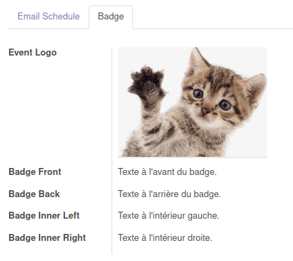
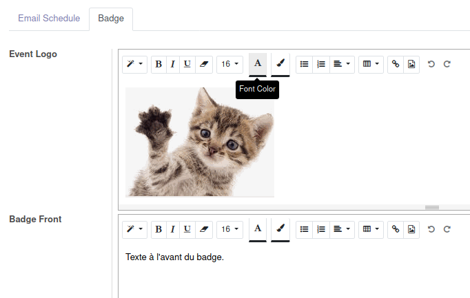
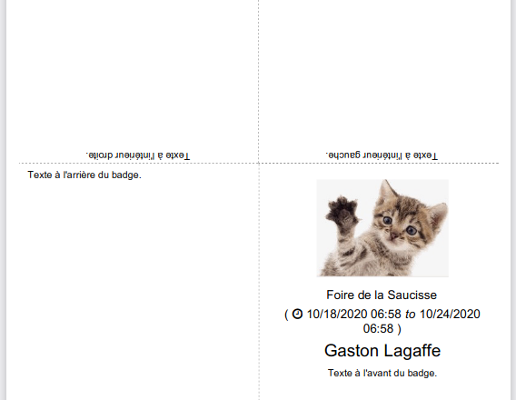

# ML Event Badge Fields

Adds fields for editing of text to display on badge front/back/left/right.

This module has been developped and tested on __Odoo 12__.

---

# Event form

A new tab is added witch allows you to edit additional content to the event :

  * **Event Logo** : may contain text and images that will be displayed on the top of the front page. If this field is empty, the company's logo is used instead.
  * **Badge Front** : Text and images to display on the front page, below the event information.
  * **Badge Back**, **Badge Inner Left**, **Badge Inner Right** : Text and images to display on the other pages.

Any HTML content can be placed in these fields. The text can be formatted as you want, using Odoo's built-in HTML editor. You can also add lists, tables, ...

# Result

Here's an example of an attendee's badge with additionnal content :

